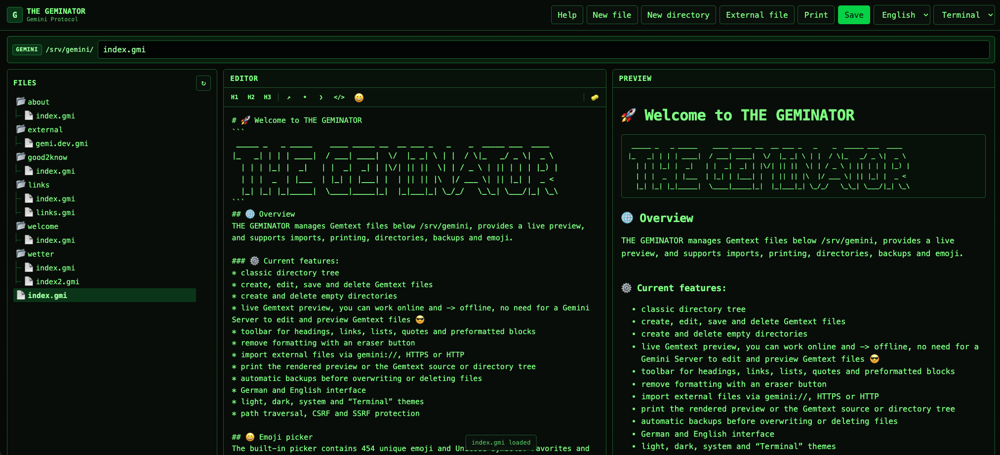

# 🚀 Welcome to THE GEMINATOR
```
 _____ _   _ _____    ____ _____ __  __ ___ _   _    _  _____ ___  ____
|_   _| | | | ____|  / ___| ____|  \/  |_ _| \ | |  / \|_   _/ _ \|  _ \
  | | | |_| |  _|   | |  _|  _| | |\/| || ||  \| | / _ \ | || | | | |_) |
  | | |  _  | |___  | |_| | |___| |  | || || |\  |/ ___ \| || |_| |  _ <
  |_| |_| |_|_____|  \____|_____|_|  |_|___|_| \_/_/   \_\_| \___/|_| \_\
```

## 🌐 Overview
THE GEMINATOR manages Gemtext files below /srv/gemini, provides a live preview, and supports imports, printing, directories, backups and emoji.

### ⚙️ Current features:
* classic directory tree
* create, edit, save and delete Gemtext files
* create and delete empty directories
* live Gemtext preview, you can work online and -> offline, no need for a Gemini Server to edit and preview Gemtext files 😎
* toolbar for headings, links, lists, quotes and preformatted blocks
* remove formatting with an eraser button
* import external files via gemini://, HTTPS or HTTP
* print the rendered preview or the Gemtext source or directory tree
* automatic backups before overwriting or deleting files
* German and English interface
* light, dark, system and “Terminal” themes
* path traversal, CSRF and SSRF protection

## 😀 Emoji picker
The built-in picker contains 454 unique emoji and Unicode symbols. Favorites and recently used symbols are stored locally in the browser.

## 📄 Supported file types
Editable and saveable
* .gmi, 
* .gemini, 
* .txt

## ➡️ External imports
* text/gemini, 
* text/plain, 
* text/markdown
HTML and binary files are not loaded into the text editor. Capsule downloads are opened through their links in a Gemini client.

## ⌨️ Keyboard shortcuts
Ctrl/Cmd + S — Save file

## Requirements
* a Webserver like Apache 2.4 or Nginx with PHP-FPM
* PHP 8.1 or newer with followig modules
```
curl
filter
json
openssl
session
```

This is THE GEMINATOR!
